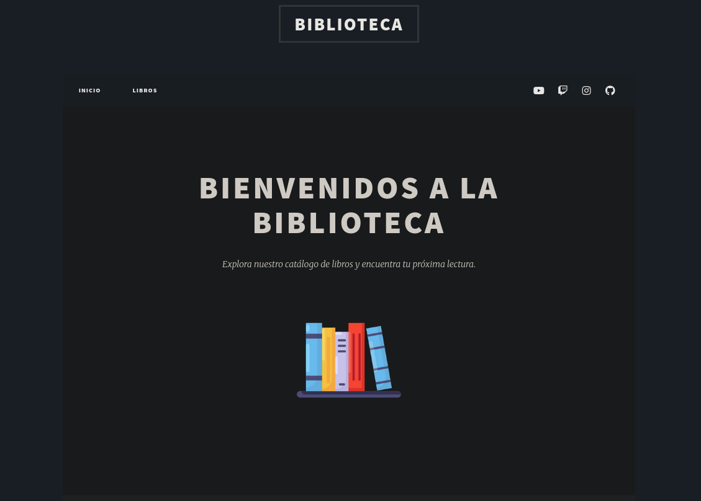
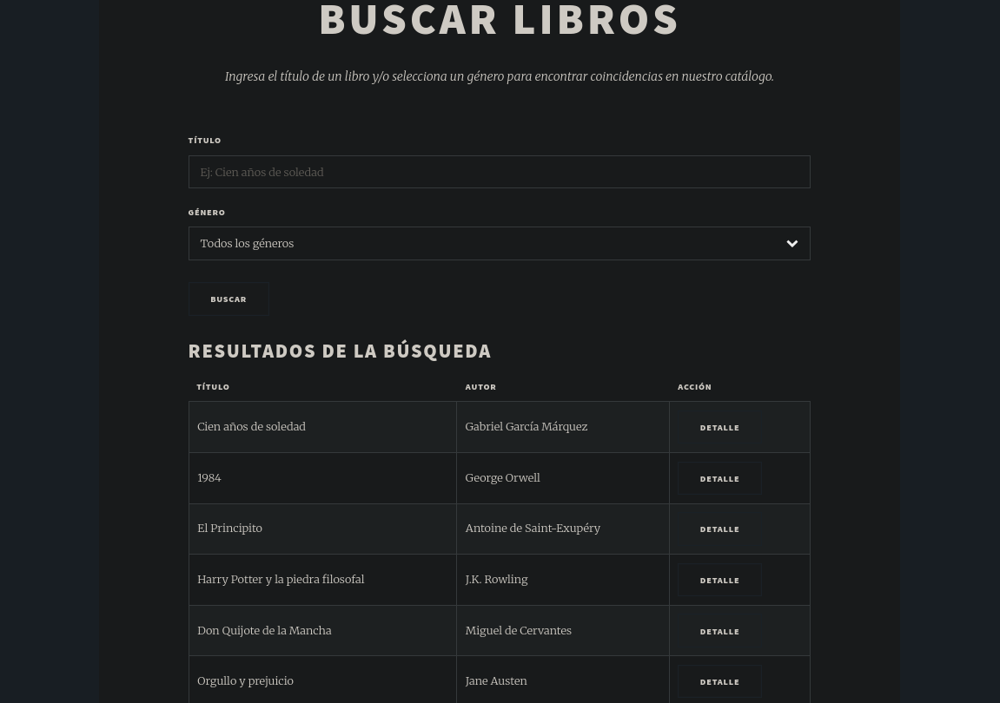
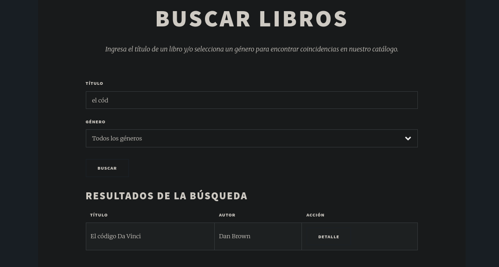
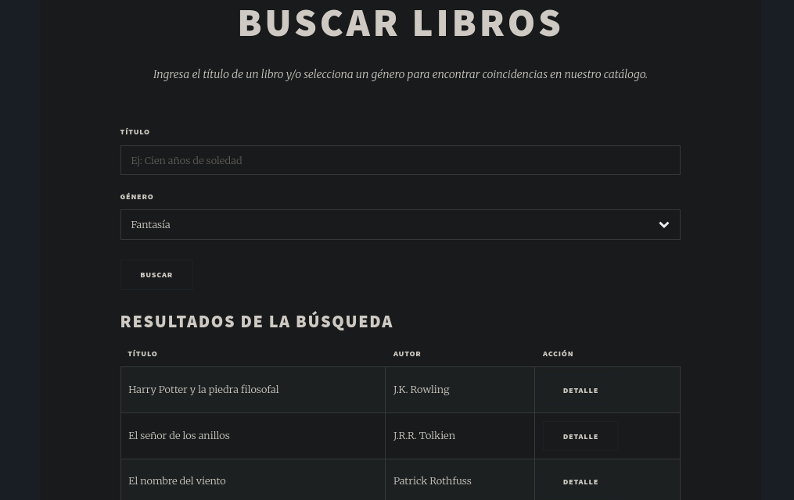
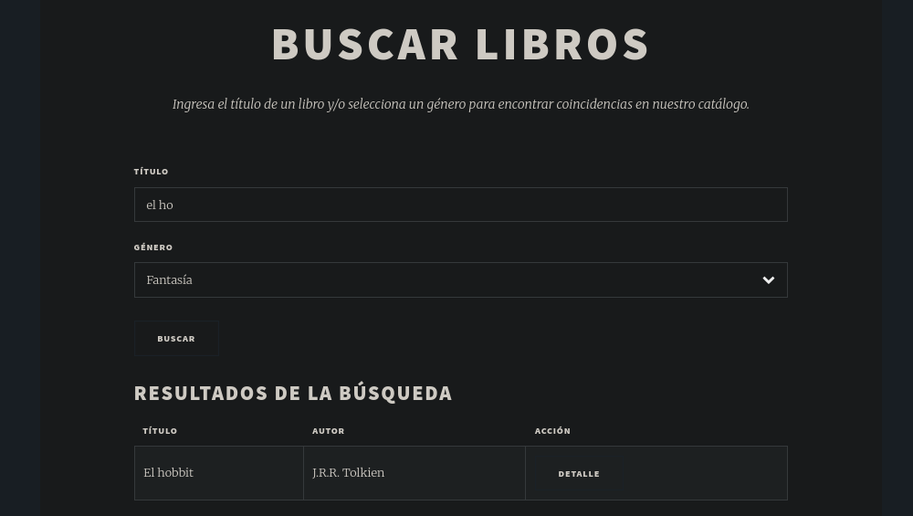
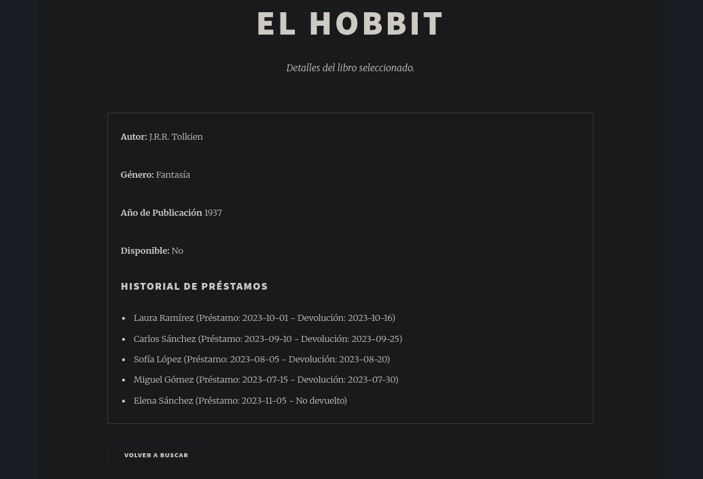
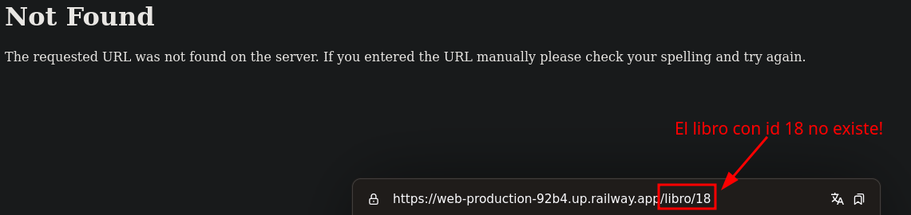

# Proyecto Flask

## Descripción

Aplicación web desarrollada con Flask para la gestión de un catálogo de libros. El proyecto usa una plantilla de la web HTML5 UP y un archivo JSON donde se encuentran los datos de los libros.

## Características

- Página principal con un logo que cuando se le hace clic lleva al usuario a la página de búsqueda de libros.
- Formulario de búsqueda por título y/o género de los libros.
- Página de detalles de cada libro (información más detallada de cada uno).

## Instalación y Ejecución en Local

1. Clonar el repositorio:

```bash
git clone https://github.com/f1rul4yx/Proyecto_Flask
```

2. Creación del entorno virtual:

```bash
python3 -m venv Proyecto_Flask/
```

3. Instalación de dependencias:

```bash
cd Proyecto_Flask/
source bin/activate
pip install -r requirements.txt
```

4. Ejecución del programa:

```bash
python3 app.py
```

5. Abrir web:

- En un navegador introducir la url `127.0.0.1:5000` o `<ip_de_tu_máquina>:5000`.

## Despliegue

- **Plataforma usada**: Railway
- [**URL de la web desplegada**](https://web-production-92b4.up.railway.app)
- **Pasos para desplegar**:
  1. Instalar dependencias: `pip install gunicorn`.
  2. Crear archivo Procfile con el siguiente contenido: `web: gunicorn app:app`.
  3. Crear el proyecto en Railway vinculando el repositorio de GitHub.

## Capturas

- Página principal:
  
- Búsqueda de todos los libros:
  
- Búsqueda por título:
  
- Búsqueda por género:
  
- Búsqueda por título y género:
  
- Detalles del libro:
  
- Error 404:
  

## Mejoras Implementadas

- Ruta única para búsqueda y resultados.
- Recordar entrada de la búsqueda de título.
- Búsqueda de libros por género.
- Recordar entrada de la búsqueda de género.
